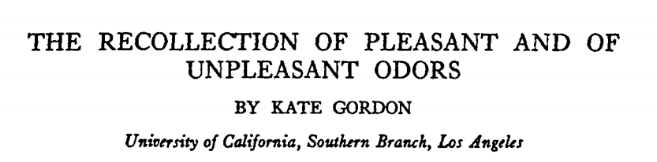
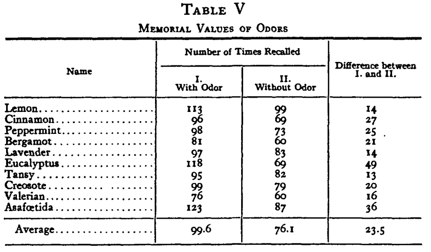
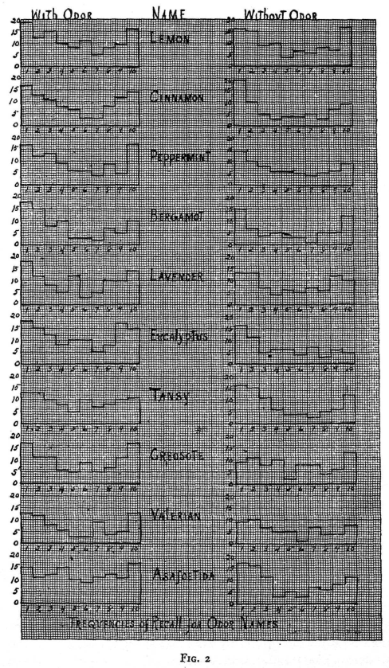

```{r setup, include=FALSE}
# knitr::opts_chunk$set(echo = TRUE)
library(dplyr)
```

# Pre-test


## _Think_ about your honest answers to the following questions

- How do you statistically test a hypothesis? What steps would you take?

- What does a _p_-value mean?

- Given the results of your test, what is the probability that you would replicate your findings in a follow-up experiment?


## _Without teaching_, discuss your answers

- How do you statistically test a hypothesis? What steps would you take?

- What does a _p_-value mean?

- Given the results of your test, what is the probability that you would replicate your findings in a follow-up experiment?


# The Replication Crisis


## This is a BIG problem

### Szucs & Ioannidis, 2017
 - 26,841 statistical records from 3,801 cognitive neuroscience and psychology papers published recently
 - median power to detect small, medium, and large effects was 0.12, 0.44, and 0.73, reflecting no improvement through the past half-century
 - false report probability is likely to __exceed 50%__ for the whole literature


## Not the important stuff, though?

### Szucs & Ioannidis, 2017
- the higher the impact factors of the journals, the lower the statistical power
- "... low replication success in psychology is realistic, and __worse performance may be expected for cognitive neuroscience__."


## Only a Matter of Incentives?

<div class="fragment">
### The _strategic-game hypothesis_
> Science is a game that scientists play to maximize their chances of acquiring publications and other trophies.
</div>

<div class="fragment">
### The _statistical-ritual hypothesis_
 > the replacement of good scientific practice by a statistical ritual that researchers perform ... because they have internalized the ritual and genuinely believe in it
</div>


# The Idol of Automatic Inference and the Elimination of Judgment


## The inference revolution

- Occurred between 1940 and 1955
- Focus moved from causes to probabilities and inference
- Sample -> Population


## What did psychologists do before the inference revolution?

- Single-case data in detail
  - means
  - std. dev.
  - correlations
  - other descriptives
- As a result, there was more emphasis on
  - double-blind experiments
  - minimizing measurement error
  - replicating findings


## I chose a study at random



Gordon, K. (1925). The recollection of pleasant and of unpleasant odors. _Journal of Experimental Psychology, 8_(3), 225--239.

---



---



---


## Significance was determined by judgment and critical thinking, not inferential statistics

> Without calculating p values or Bayes factors, Wolfgang Köhler developed the Gestalt laws of perception, Ivan P. Pavlov the principles of classical conditioning, B. F. Skinner those of operant conditioning, George Miller his magical number seven plus or minus two, and Herbert A. Simon his Nobel Prize–winning work on bounded
rationality.


# Elimination of judgment


## The null ritual
### This is what we do

1. Set up a null hypothesis of “no mean difference” or “zero correlation.” Do not specify the predictions of your own research hypothesis.

2. Use 5% as a convention for rejecting the null hypothesis. If the test is significant, accept your research hypothesis. Report the test result as p < .05, p < .01, or p < .001, whichever level is met by the obtained p value.

3. Always perform this procedure.


## Fisher is probably rolling in his grave

<div class="fragment">
> No scientific worker has a fixed level of significance at which from year to year, and in all circumstances, he rejects hypotheses; he rather gives his mind to each particular case in the light of his evidence and his ideas. (Fisher, 1956, p. 42)
</div>


## Fisher’s null hypothesis testing:

1. Set up a statistical null hypothesis. The null need not be a nil hypothesis (i.e., zero difference).

2. Report the exact level of significance (e.g., _p_ = 0.051 or _p_ = 0.049). Do not use a conventional 5% level, and do not talk about accepting or rejecting hypotheses.

3. Use this procedure only if you know very little about the problem at hand.


## Neyman and Pearson don't like it either (Fisher's contemporaries)

- What is the __alternative__?  
- What kinds of probabilities are associated with it?  
- Have you balanced Type I and Type II errors?


## Neyman–Pearson decision theory:

1. Set up two statistical hypotheses, $H_1$ and $H_2$, and decide about $\alpha$, $\beta$, and sample size before the experiment, based on subjective cost-benefit considerations. These define a rejection region for each hypothesis.

2. If the data falls into the rejection region of $H_1$, accept $H_2$; otherwise accept $H_1$. Note that accepting a hypothesis does not mean that you believe in it, but only that you act as if it were true.

3. The usefulness of the procedure is limited among others to situations where you have a disjunction of hypotheses (e.g., either $\mu_1$ = 8 or $\mu_2$ = 10 is true) and where you can make meaningful cost-benefit trade-offs for choosing $\alpha$ and $\beta$.


## Neyman-Pearson example: Quality Control (Gigerenzer et al., 1989, chapter 3)

- Imagine a manufacturer of metal plates that are used in medical instruments.
- __Hypotheses.__ The machines make plates with a mean diameter of
  - $H_1$: 8 mm (optimal)
  - $H_2$: 10 mm (potentially dangerous)
- She knows from experience that
  - random fluctuations of diameters are approximately normally distributed
  - the standard deviations do not depend on the mean
- Cost-benefit analysis:
  - False alarms are less serious, so she sets $\alpha$ = .001
  - Misses may cause harm, so she sets $\beta$ = .1
- One day she finds she must accept $H_2$
  - She must stop manufacture (decision) and start __investigation__


## The null ritual
### One more time to wallow in shame

1. Set up a null hypothesis of “no mean difference” or “zero correlation.” Do not specify the predictions of your own research hypothesis.

2. Use 5% as a convention for rejecting the null hypothesis. If the test is significant, accept your research hypothesis. Report the test result as _p_ < .05, _p_ < .01, or _p_ < .001, whichever level is met by the obtained _p_ value.

3. Always perform this procedure.


## Isn't __ritual__ a strong word?

<div class="fragment">
| Ritual                                 | Stats                                      |
|----------------------------------------|--------------------------------------------|
| sacred numbers or colors               | 5%; fMRI color gradients                   |
| repetition of the same action          | same stats; same tests                     |
| fear about being punished for stopping | fear of sanctions by editors or advisors   |
| wishful thinking and delusions         | delusions about the meaning of the p value |
</div>


# Systematic Delusions About Replication


## The null ritual is a large part of the problem

- Under the _strategic-game hypothesis_, an editor's requirements should be treated like gold-plated tablets, worshipped and idolized.

<div class="fragment">
> I want to make two main points in this article. First, hypothesis testing is overrated, overused, and practically useless as a means of illuminating what the data in some experiment are trying to tell us. Second, graphical presentation methods are a much better way to provide such illumination, particularly given the ease with which present computer technology allows such methods to be implemented.

> Loftus, 1993, first editorial in _Memory & Cognition_
</div>


## The null ritual is a large part of the problem

- Did his crusade work?
  - before: 53% of articles relied on the null ritual
  - during: 32%
  - after: 55%
- he complained that researchers were
  - unwilling to abandon _p_
  - confused _SD_ and _SE_
  - could not compute _CI_ 
    - he computed ~100 himself and requested ~300 (Finch et al., 2004)


---

> My hypothesis is that, beyond incentives, the key issue is researchers’ internalized belief in the ritual. If researchers only opportunistically adapt their behavior to the incentives in order to get published and promoted, then their common sense with regard to statistical thinking should remain intact.


# Probability of replication = 1 - _p_


## What can we say about p and replication?

- Does this statement logically follow from a significant result where, _p_ = .01?
- You have a reliable experimental finding in the sense that if, hypothetically, the experiment were repeated a great number of times, you would obtain a significant result on 99% of occasions.
- Oakes, 1986, p. 80


## Josh Samani and Bernoulli can help explain

- We have a coin that we want to test for bias
- We flip it _N_ times and it comes up heads _n_ times yielding an estimate of bias $\hat{\beta}_1 = n / N$
- Because coin flips are dichotomous, we can represent the probability of replicating using a Bernoulli distribution:
  - $\approx \sum_{n_2\,\text{such that} \,p_2\leq 0.05} P(\hat\beta_2 \,|\,\hat\beta_1)$
  - $\approx \sum_{n_2\,\text{such that} \,p_2\leq 0.05} \binom{N}{n_2}\hat\beta_1^{n_2}(1-\hat\beta_1)^{N - n_2}$
  

## Josh Samani and Bernoulli can help explain

| _n_ heads | _p_-value | _p_ rep |
|-----------|-----------|---------|
|        21 |    0.0428 |  0.5888 |
|        22 |    0.0161 |  0.7384 |
|        23 |    0.0052 |  0.8591 |
|        24 |    0.0014 |  0.9389 |
|        25 |    0.0003 |  0.9803 |
|        26 |    0.0001 |  0.9958 |
|        27 |    0.0    |  0.9995 |
|        28 |    0.0    |  1.0    |
|        29 |    0.0    |  1.0    |
|        30 |    0.0    |  1.0    |        


## Probability of replication = 1 - _p_
### Most psychologists get this wrong

- Previous problem, Oakes, 1986, p. 80:
  - 60% of psychologists answered __true__
  - This is reliable over a number of replications


## Probability of replication = 1 - _p_
### Most psychologists get this wrong

<div class="fragment">

</div>


# The illusion of certainty and Bayesian wishful thinking


## What does _p_ really mean?

<div class="fragment">
> As I have mentioned, a p value is a statement about the probability of a statistical summary of data, assuming that the null hypothesis is true.
</div>

- It is not about whether the null or alternative is true
- __Illusion of certainty__: the belief that statistical significance delivers certainty


## What does 1 - _p_ really mean?

- __Bayesian wishful thinking__: the belief that 1 - _p_ is the probability that the alternative hypothesis is true
- If _p_ is the probability that we would have found a result as or more extreme as the one we found given that the null hypothesis is true,
- then 1 - _p_ is the probability that we would have found a result less extreme than the one we found given that the null hypothesis is true


## Test yourself (True / False)

> Suppose you have a treatment that you suspect may alter performance on a certain task. You compare the means of your control and experimental groups (say, 20 subjects in each sample). Furthermore, suppose you use a simple independent means t-test and your result is significant (t = 2.7, df = 18, p = .01).

1. You have absolutely disproved the null hypothesis (i.e., there is no difference between the population means).
2. You have found the probability of the null hypothesis being true.
3. You have absolutely proved your experimental hypothesis (that there is a difference between the population means).


## Test yourself (True / False)

> Suppose you have a treatment that you suspect may alter performance on a certain task. You compare the means of your control and experimental groups (say, 20 subjects in each sample). Furthermore, suppose you use a simple independent means t-test and your result is significant (t = 2.7, df = 18, p = .01).

4. You can deduce the probability of the experimental hypothesis being true.
5. You know, if you decide to reject the null hypothesis, the probability that you are making the wrong decision.
6. You have a reliable experimental finding in the sense that if, hypothetically, the experiment were repeated a great number of times, you would obtain a significant result on 99% of occasions


## Beliefs we (incorrectly) hold when _p_ < .05

1. The null hypothesis has been shown to be false.

2. The probability of the null hypothesis being true is known.

3. The alternative hypothesis has been shown to be true.

4. The probability of the alternative hypothesis being true is known.

5. The probability of incorrectly rejecting the null hypothesis is known.

6. The probability of replicating is 1 - _p_


## Delusion about significance among medical doctors and researchers
### Asked of 246 physicians at 3 major academic universities (BJH, B&W, MassGen)

- Consider a typical medical research study, for example designed to test the efficacy of a drug, in which a null hypothesis H0 (‘no effect’) is tested against an alternative hypothesis H1 (‘some effect’). Suppose that the study results pass a test of statistical significance (that is P-value <0.05) in favor of $H_1$. What has been shown?

1. $H_0$ is false.
2. $H_0$ is probably false.
3. $H_1$ is true.
4. $H_1$ is probably true.
5. Both (1) and (3)
6. Both (2) and (4)
7. None of the above


## Delusion about significance among medical doctors and researchers
### Asked of 246 physicians at 3 major academic universities (BJH, B&W, MassGen)

- Consider a typical medical research study, for example designed to test the efficacy of a drug, in which a null hypothesis H0 (‘no effect’) is tested against an alternative hypothesis H1 (‘some effect’). Suppose that the study results pass a test of statistical significance (that is P-value <0.05) in favor of $H_1$. What has been shown?

1. (4%) $H_0$ is false.
2. (31%) $H_0$ is probably false.
3. (0%) $H_1$ is true.
4. (20%) $H_1$ is probably true.
5. (3%) Both (1) and (3)
6. (36%) Both (2) and (4)
7. (6%) None of the above


# Publish or Perish and Power


## Power is good, why don't we consider it?

<div class="fragment">
### Cohen, 1962: 
#### median power to detect a medium-sized effect was only 46%
</div>

<div class="fragment">
### Szucs & Ioannidis, 2017: 
#### median power to detect small, medium, and large effects was 12%, 44%, and 73%
</div>

<div class="fragment">
### Perhaps because it isn't part of the ritual
</div>


## We compensate and hide our bad behavior

| Questionable practice | admitted | estimated |
|-----------------------|----------|-----------|
| Failing to report all dependent mesaures | 67% | 78% |
| Collecting more data after seeing whether results
were significant | 58% | 72% |
| Selectively reporting studies that “worked” | 50% | 67% |
| Excluding data after looking at their impact | 43% | 62% |
| Reporting an unexpected finding as having been predicted from the start | 35% | 54% |
| Failing to report all of a study’s conditions | 27% | 42% |
| Rounding down a p value (e.g., reporting .054 as less than .05) | 23% | 39% |


# General Discussion


## Four predictions of the _statistical-ritual hypothesis_

1. Researchers should share the replication delusion
2. Researchers should share the illusion of certainty
3. Researchers should exhibit Bayesian wishful thinking
4. Researchers should be largely blind to statistical power because it is not part of the ritual


## What to do

1. editors should no longer accept manuscripts that report results as "significant" or "not significant."

2. editors should make a distinction between research aimed at developing hypothses and research aimed at testing hypotheses.

3. editors should require competitive-hypothesis testing, not null-hypothesis testing. 

4. psychology departments should teach the statistical toolbox, not a statistical ritual.


## What would be in the toolbox?

- techniques to visualize the descriptive statistics of the sample
- Tukey’s exploratory data analysis
- meta-analysis
- estimation
- Fisher’s null-hypothesis testing
  - when we don't have information or a precise alternative
- Neyman-Pearson decision theory
  - competing hypotheses
- Bayesian inference
  - when priors are known
  - can estimate probabilities of truth


# Most importantly: use __common sense__ and __sound judgment__, not rituals
